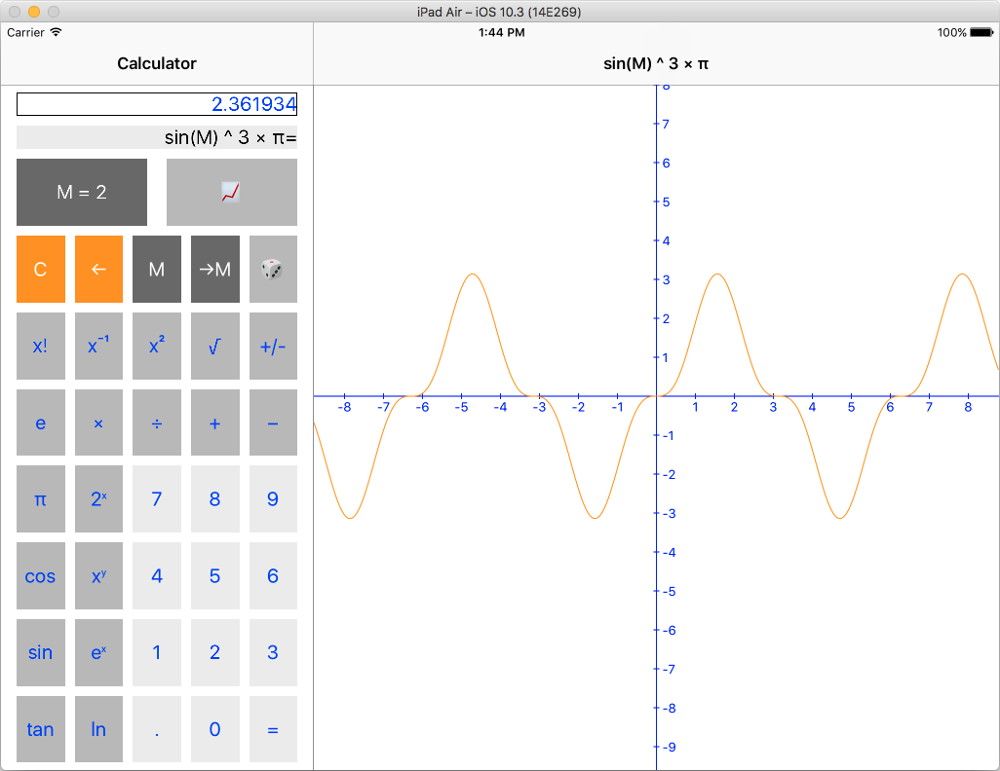

# StanfordCalculator
Project from course [Developing iOS 9 Apps with Swift](https://itunes.apple.com/ua/course/developing-ios-9-apps-swift/id1104579961)

Done
* [Programming Project 1: Calculator](https://itunes.apple.com/ua/course/programming-project-1-calculator/id1104579961?i=1000367795521&mt=2)
* [Programming Project 2: Calculator Brain](https://itunes.apple.com/ua/course/programming-project-2-calculator/id1104579961?i=1000367941540&mt=2)

